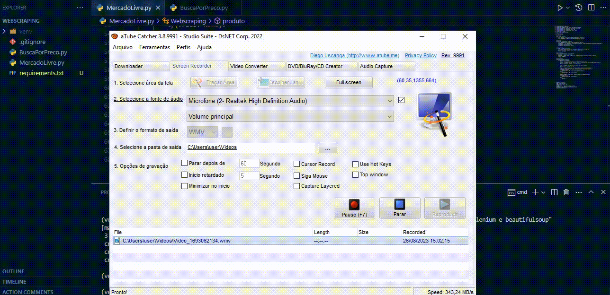

# webscraping-produtos-ML
É feito um webscraping na pagina do mercado livre , buscando um produto que é passado por parâmetro no metodo

## Tecnologias utilizadas
<ul>
  <li>Python</li>
  <li>Selenium</li>
  <li>BeautifulSoup</li>
</ul>

## Screenshot

